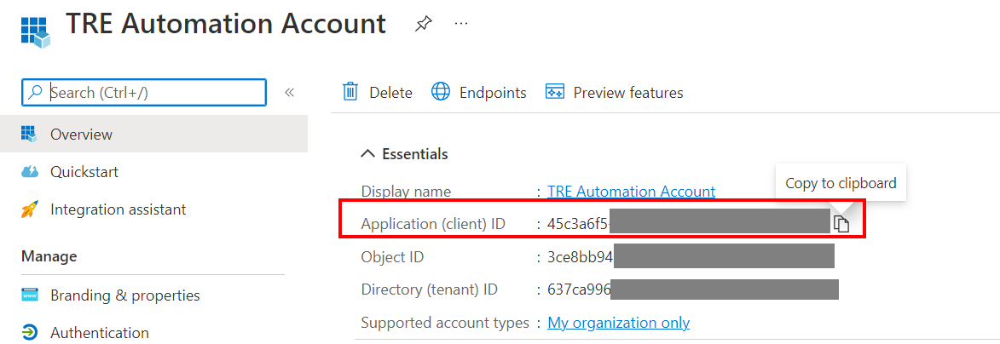
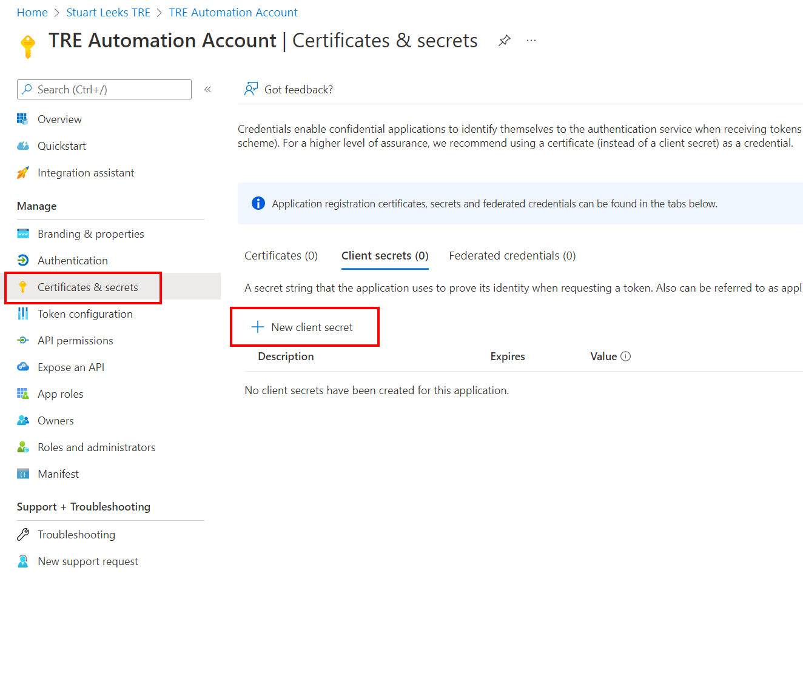
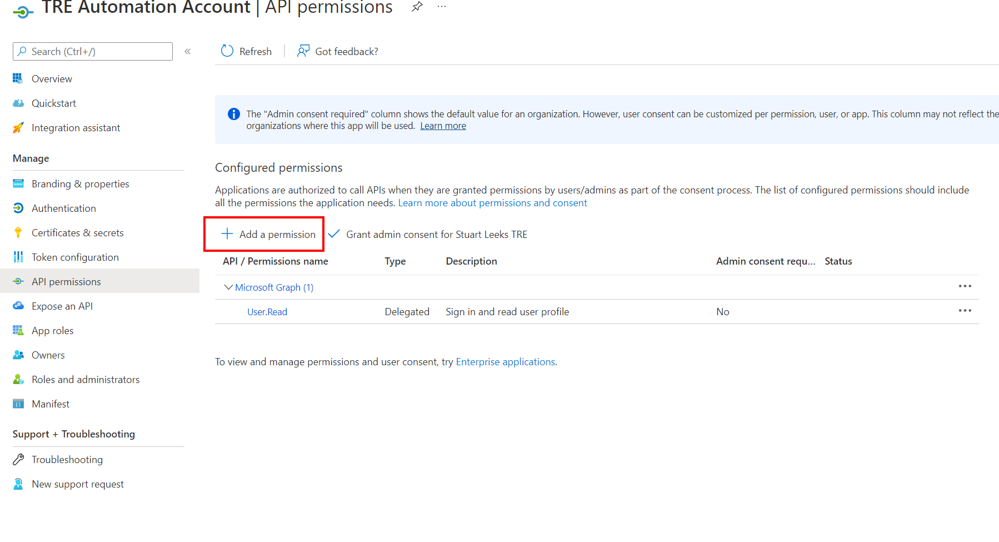
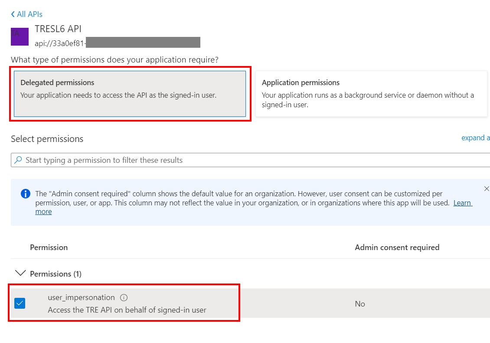
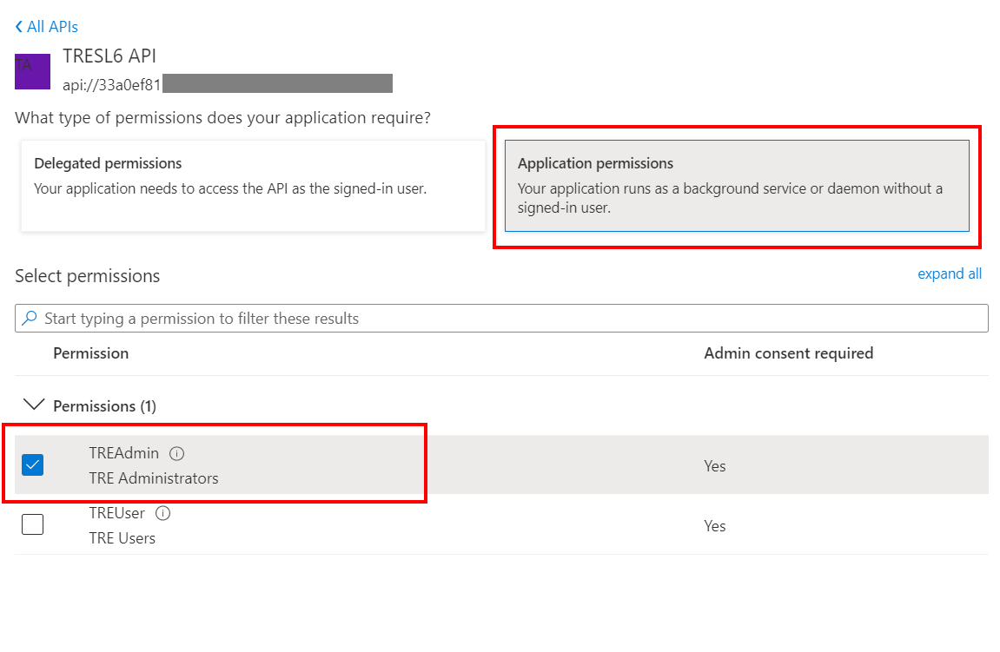

# TRE Automation Admin Application

## Name
The Automation Application is typically called `<TRE_ID> Automation Admin` within the AAD Portal.

## Purpose
This application is used to authorize end-to-end test scenarios.


!!! note
    - This app registration is only needed and used for **testing**


## Application Roles
This application does not have any roles defined.

## Permissions
| Name | Type* | Admin consent required |  TRE usage |
| --- | -- | -----| --------- |
|TRE API / TREAdmin|Application|Yes|This allows this application to authenticate as a TRE Admin for running the tests locally and the E2E in the build.|
|TRE API / user_impersonation|Delegated|No|This allows the application to impersonate the logged in user.|
|TRE - workspace x API / WorkspaceOwner|Application|Yes|This allows this application to authenticate as a Workspace Owner for running the tests locally and the E2E in the build.|
|TRE - workspace x  API / user_impersonation|Delegated|No|This allows the application to impersonate the logged in user.|

'*' See the difference between [delegated and application permission](https://docs.microsoft.com/graph/auth/auth-concepts#delegated-and-application-permissions) types. See [Microsoft Graph permissions reference](https://docs.microsoft.com/graph/permissions-reference) for more details.

## Clients
This application is used locally to automatically register bundles against the API and is the user that runs the E2E locally and in the Build.

## Environment Variables
| Variable | Description | Location |
| -------- | ----------- | -------- |
|TEST_ACCOUNT_CLIENT_ID|The Client Id|`./config.yaml`|
|TEST_ACCOUNT_CLIENT_SECRET|The client secret|`./config.yaml`|

## How to create
Example on how to run the script:

```bash
./devops/scripts/aad/create_automation_administrator.sh \
--name "${TRE_ID}"
```

| Argument | Description |
| -------- | ----------- |
| `--name` | The prefix of the name of the app registrations. `TRE123` will give you `TRE123 Automation Admin`. |
| `--reset-password` | Optional, default is 0. When run in a headless fashion, 1 is passed in to always reset the password. |


### Create this application from the portal (optional)
To create an application registration for automation, open the Microsoft Entra Workforce ID tenant for your TRE in the portal and navigate to "App Registrations".
Click "New registration" as shown in the image below.


Enter a name for the application registration and click "Register".


On the app registration "Overview" page, copy the "Application (client) ID" value and save it for later.



Under "Manage", click on "Certificates & secrets" and then "New client secret"



Add a description and create the client secret. Once done, the secret value will be displayed (as shown below). Copy this value and save it for later as you cannot retrieve it again after closing this page.


#### Add API Permissions

After creating the automation application registration, it needs to be granted permissions to access the TRE API.
Navigate to the API permissions page for the application registration and click "Add a permission"



Next, click on the "My APIs" tab, and then on "TRE API"
On the "Delegated permissions" section, select "user_impersonation".



On the "Application permissions" section, select "TRE Administrators".



Back on the main permissions page, click on "Grant admin consent". Once done, you should see "Granted" in the "Status" column, as shown below.


