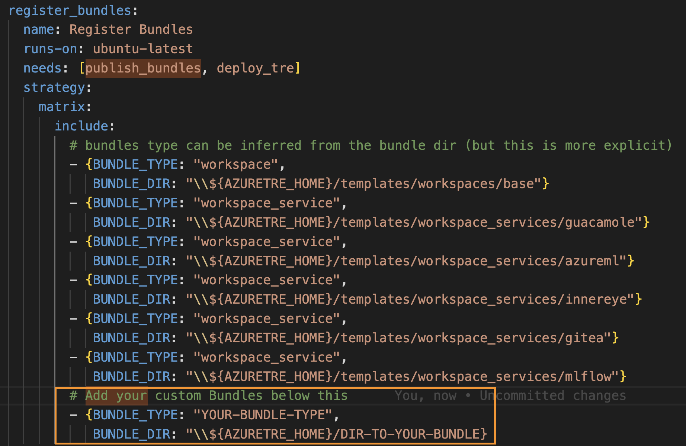

# Pipelines

The [AzureTRE deployment repository](https://github.com/microsoft/AzureTRE-Deployment) contains the following github workflows:

1. Build Validation - validates the code by running linter and terraform validation.
1. Clean Validation Environments - a periodical workflow to clean unused AzureTRE environments.
1. Deploy Azure TRE (branch) - This workflow is intended to be used to test workflow changes. It deploys AzureTRE using the workflows defined on the branch
1. Deploy Azure TRE - This workflow is the integration build run for pushes to the main branch. It also runs on a schedule, serving as the nightly build to keep the main AzureTRE env in sync.
1. Deploy Azure TRE Reusable - responsible to deploy AzureTRE. It is referenced in other Azure TRE deployment workflows.

## Setup Github Environment

The workflows are using Github environment to source its environment variables. Follow [this guide](https://docs.github.com/en/actions/deployment/targeting-different-environments/using-environments-for-deployment#creating-an-environment) to define it in your github repository and provide it as an input for the workflows.

The following environment variables should be defined in your github environment:

1. [Auth env vars](../../tre-admins/auth.md##create_authentication_assets)
1. [Core and Devops env vars](../../tre-admins/environment-variables.md)

Having all the environment variables set in the Github environment the next step will be to use it in your pipelines:

In AzureTRE deployment repository You will find all the pipelines under the folder `.github/workflows` on top of each workflow there is the workflow
inputs part where the used Github environment name is set, make sure to update it with yours, for example:

## Publish Custom Templates in Pipelines

If you have created custom AzureTRE templates you can publish and register them as part of the CI/CD pipelines. To do so follow the next steps:
1. Go to `.github/workflows/deploy_tre_reusable.yml` workflow. Add your template under the following jobs:
    - publish_bundles:
        
    - register_bundles:
        
    - If it is a user resource add it also under register_user_resource_bundles:
        

## Clean Validation Environments

This is a periodical workflow to clean unused AzureTRE environments created by your CI/CD.

If you have E2E tests running and creating workspaces as part of your workflow you can make clean validation to remove those periodicaly for you. To do so, go to the `.github/scripts/clean_ci_validation_envs.sh` and uncomment the following part:

Replace the github_org and  github_repo with your github organization and repository name.

## How to Contribute to our Documentation

If you have any comments or suggestions about our documentation then you can visit our GitHub project and either raise a new issue, or comment on one of the existing ones.

You can find our existing documentation issues on GitHub by clicking on the link below:

[Existing Documentation Issues](https://github.com/microsoft/AzureTRE/issues?q=is%3Aissue+is%3Aopen+label%3Adocumentation)

Or, you can raise a new issue by clicking on this link:

[Report an Issue or Make a Suggestion](https://github.com/microsoft/AzureTRE/issues/new/choose)

**Thank you for your patience and support!**
