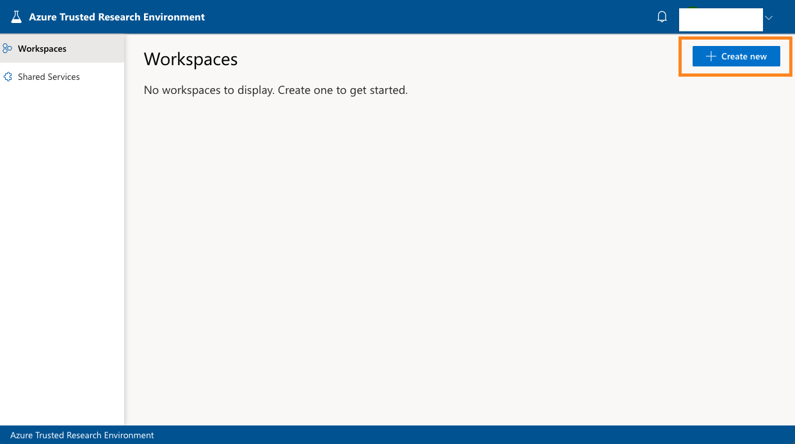
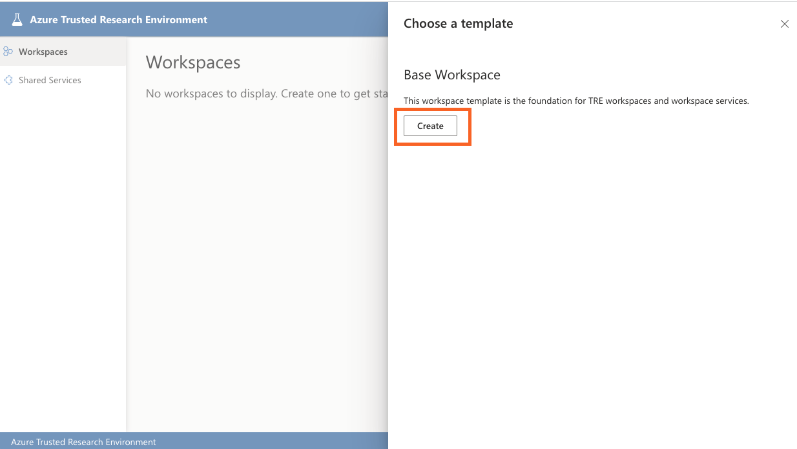
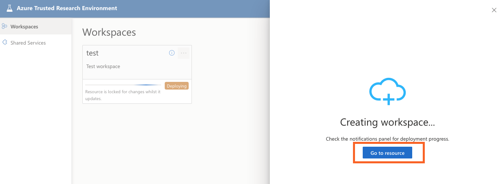
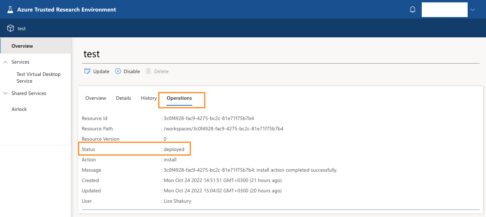

# Installing base workspace

## Publishing and registering the base workspace bundle

Run the following in a terminal:

  ```cmd
  make bundle-publish DIR=$AZURETRE_HOME/templates/workspaces/base
  make bundle-register DIR=$AZURETRE_HOME/templates/workspaces/base BUNDLE_TYPE=workspace
  ```

## Create Base Workspace

Workspace can be easily created via AzureTRE UI. Open a browser and navigate to: `https://<TRE_ID>.<LOCATION>.cloudapp.azure.com/` (replace TRE_ID and LOCATION with values from previous steps). It will require you to log in, make sure you login with a user who is a TREAdmin.

1. Select Workspaces -> Create New:

    

1. Click on Create under Base Workspace:

    

1. Fill in the details for your workspace:

    - Fill in general information such as name and description
    - [Optional] Update values for Shared Storage Quota, App Service Plan (SKU) and Address space if needed
    - Application (Client ID) - is the AAD Application representing the workspace. You can auto create one by setting it to `auto_create` or provide an existing one. In case of providing a specific client id make sure to fill in the Application (Client) Secret field too. To read about how to create it manually read the [Creating an Application Client for base workspace](#creating-an-application-client-for-base-workspace) section below

    After filling the details press submit.

    

1. Select go to resource to see its status:

    

1. Navigate to Operation and wait till changed to deployed:

    

Workspace is now ready to use.


## Creating an Application Client for base workspace

As explained in the [auth guide](../auth.md), every workspace has a corresponding app registration which if you haven't run `make auth`; can be created using the helper script `./devops/scripts/aad/create_workspace_application.sh`. For example:

```bash
  ./devops/scripts/aad/create_workspace_application.sh \
    --name "${TRE_ID} - workspace 1" \
    --admin-consent \
    --ux-clientid "${SWAGGER_UI_CLIENT_ID}" \
    --automation-clientid "${TEST_ACCOUNT_CLIENT_ID}" \
    --application-admin-clientid "${APPLICATION_ADMIN_CLIENT_ID}"
```

!!! caution
    If you're using a separate tenant for AAD app registrations to the one where you've deployed the TRE infrastructure resources, ensure you've signed into that tenant in the `az cli` before running the above command. See **Using a separate Azure Active Directory tenant** in [Setup Auth configuration](setup-auth-entities.md) for more details.

Running the script will report `WORKSPACE_API_CLIENT_ID` and `WORKSPACE_API_CLIENT_SECRET` for the generated app. Copy these into `/templates/core/.env` so that automated testing will work. You also need to use `WORKSPACE_API_CLIENT_ID` and `WORKSPACE_API_CLIENT_SECRET` in the form.

## Next steps

* [Installing a workspace service & user resources](./ui-install-workspace-service-and-user-resource.md)
