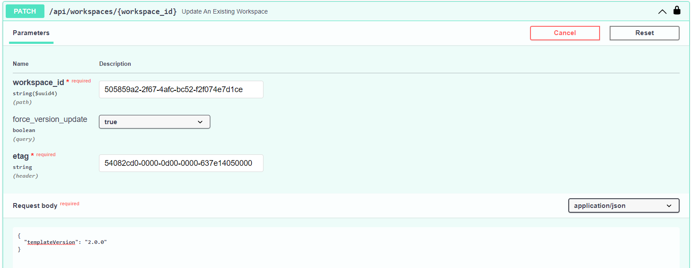

<!-- markdownlint-disable-file MD046 -->
# Upgrading Resources Version

Azure TRE workspaces, workspace services, workspace shared services, and user resources are [Porter](https://porter.sh/) bundles. Porter bundles are based on [Cloud Native Application Bundles (CNAB)](https://cnab.io/).

When a new bundle version becomes available, users can upgrade their resources to a newer version after building, publishing and registering the bundle template.

Upgrades (and downgrades) are based on [CNAB bundle upgrade action](https://getporter.org/bundle/manifest/#bundle-actions).

Bundle template versions follow [semantic versioning rules](../tre-workspace-authors/authoring-workspace-templates.md#versioning).

!!! Note
    Only minor and build version upgrades are automatically allowed within the Azure TRE upgrade mechanism. Major versions upgrades and any version downgrades are blocked as they are assumed to contain breaking changes or changes that require additional consideration.

    For users who wish to upgrade a major version, we highly recommend to read the changelog, review what has changed and take some appropriate action before upgrading using [force version update](#force-version-update).

## How to upgrade a resource using Swagger UI

Resources can be upgrade using Swagger UI, in the following example we show how to upgrade a workspace version from 1.0.0 to 1.0.1, other resources upgrades are similar.

1. First make sure the desired template version is registered, [follow these steps if not](../tre-admins/registering-templates.md).

1. Navigate to the Swagger UI at `/api/docs`.

1. Log into the Swagger UI using `Authorize`.

1. Click `Try it out` on the `GET` `/api/workspace/{workspace_id}` operation.

1. Provide your `workspace_id` in the parameters section and click `Execute`.

1. Copy the `_etag` property from the response body.

1. Click `Try it out` on the `PATCH` `/api/workspace/{workspace_id}` operation.

1. Provide your `workspace_id` and `_etag` parameters which you've just copied.

1. Provide the following payload with the desired version in the `Request body` parameter and click `Execute`.

    ```json
      {
        "templateVersion": "1.0.1",
      }
    ```
1. Review server response, it should include a new `operation` document with `upgrade` as an `action` and `updating` as `status` for upgrading the workspace and a message states that the Job is starting.

1. Once the upgrade is complete another operation will be created and can be viewed by executing `GET` `/api/workspace/{workspace_id}/operations`, review it and make sure its `status` is `updated`.

### Force version update
If you wish to upgrade a major version, or downgrade to any version, you can override the blocking in the upgrade mechanism by passing `force_version_update=true` query parameter to the resource `Patch` action.

For example force version patching a workspace:




