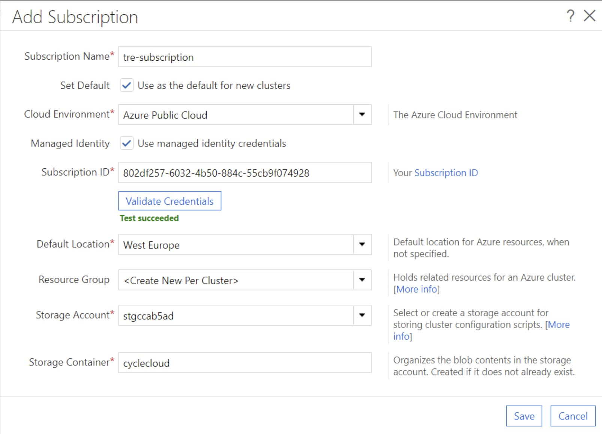

# Azure CycleCloud Shared Service
Azure CycleCloud is an enterprise-friendly tool for orchestrating and managing High Performance Computing (HPC) environments on Azure. This shared service deploys a single CycleCloud server, which can be used to by a TRE Administrator to create and manage multiple HPC clusters.


Used  "as is", this shared service is only appropriate for proof of concept work and small projects, however can be used as a starting point for more advanced scenarios.

Using the CycleCloud cluster properties the TRE Administrator can choose which virtual network the cluster will be deployed into, and hence the workspace the cluster can be accessed from.

At present there is no self service cluster creation for research teams, and as such costs are not attributed to individual workspace however this could be added in the future, and is tracked in this issue <https://github.com/microsoft/AzureTRE/issues/2230>.


## Deployment and Configuration

The CycleCloud shared service template needs registering with the TRE as per <../../tre-admins/registering-templates/> The templates can be found at `templates/shared_services/cyclecloud`.

Prior to deploying the CycleCloud server, the license terms for any Azure VM marketplace images used by CycleCloud must be accepted. This can be done by running the following command while logged into the Azure CLI:

```shell
az vm image terms accept --urn azurecyclecloud:azure-cyclecloud:cyclecloud8:latest
az vm image terms accept --urn almalinux:almalinux-hpc:8_5-hpc:latest
```

Deploy the CycleCloud server using UI or API.

To connect to the CycleCloud server, the TRE Administrator **must** connect to the CycleCloud server from the administration jumpbox (`templates/shared_services/admin-vm`).
Use Azure Bastion to connect to the jumpbox a with the username `adminuser` and the select the password located in your core KeyVault.
Connect to the CycleCloud server at the URL: `https://cyclecloud-{TRE_ID}.{LOCATION}.cloudapp.azure.com/`.

- Provide a name for the cyclecloud server instance.

- Review the terms and conditions and hit next.

- Provide your user details, including SSH key

- Hit Done, and wait for the add subscription dialog. Select the region your TRE is deployed into, leave the resource group as the default `<Create New Per Cluster>` and select the storage account beginning `stgcc`. This should look similar to:



- Hit Save, and then "Back to Clusters"

## Create a Cluster
- Before you start creating the cluster retrieve the last 4 digits of the workspace ID that you want to deploy the cluster into.

- Create a user in CycleCloud as per <https://docs.microsoft.com/en-us/azure/cyclecloud/concepts/user-management?view=cyclecloud-8#adding-new-users-to-cyclecloud> . The SSH key for the user will need to be created within the workspace and public key exporting. We suggest using the 4 digits retrieved in step 1 as part of the user account.

- Select your cluster type, we have tested Slurm and Grid Engine using the methods documented here.

- Give the cluster a name - again we suggest using the last 4 digits of the workspace ID as part of the name.Click Next.

- Select your required settings. In the **Subnet ID** box, choose the `ServicesSubnet` in the resource group and virtual network containing the 4 digit workspace ID. Click Next.

- Configure any storage settings and click Next.

- Under advanced settings, under advanced networking - uncheck Return Proxy, and Public Head node. Click Next.

- Under *cloud init*, paste the below script, with the appropriate values for TRE ID and Region into each of the nodes to ensure the package mirror is used.

```shell
#!/bin/sh
TRE_ID="mrtredemo2"
REGION="westeurope"

ls /etc/yum.repos.d/*.repo | xargs sed -i 's/mirrorlist/# mirrorlist/g'
ls /etc/yum.repos.d/*.repo | xargs sed -i "s,# baseurl=https://repo.almalinux.org/,baseurl=https://nexus-$TRE_ID.$REGION.cloudapp.azure.com/repository/almalinux/,g"

yum -y install epel-release
ls /etc/yum.repos.d/*.repo | xargs sed -i 's/metalink/# metalink/g'
ls /etc/yum.repos.d/*.repo | xargs sed -i "s,#baseurl=https://download.fedoraproject.org/,baseurl=https://nexus-$TRE_ID.$REGION.cloudapp.azure.com/repository/fedoraproject/,g"

yum -y install python3 python3-pip

sudo tee /etc/pip.conf <<EOF
[global]
index = https://nexus-$TRE_ID.$REGION.cloudapp.azure.com/repository/pypi/pypi
index-url = https://nexus-$TRE_ID.$REGION.cloudapp.azure.com/repository/pypi/simple
trusted-host = https://nexus-$TRE_ID.$REGION.cloudapp.azure.com
EOF

sudo cat > /etc/yum.repos.d/cyclecloud.repo <<EOF
[cyclecloud]
name=cyclecloud
baseurl=https://nexus-$TRE_ID.$REGION.cloudapp.azure.com/repository/microsoft-yumrepos/cyclecloud
gpgcheck=1
gpgkey=https://nexus-$TRE_ID.$REGION.cloudapp.azure.com/repository/microsoft-keys/microsoft.asc
EOF

```

- Click Save.

- Under the new cluster, click *Access* and add the user created earlier and configure node access.

- Start the cluster, ensure the cluster starts successfully and provide the users connection details as detailed here: <https://docs.microsoft.com/en-us/azure/cyclecloud/how-to/connect-to-node?view=cyclecloud-8>
