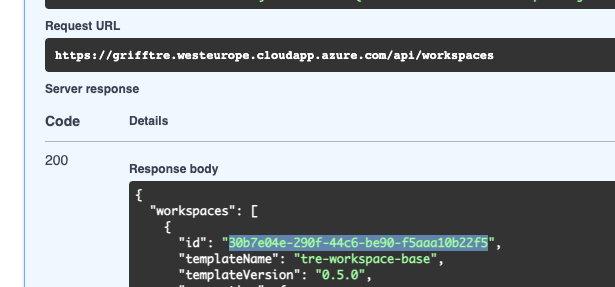
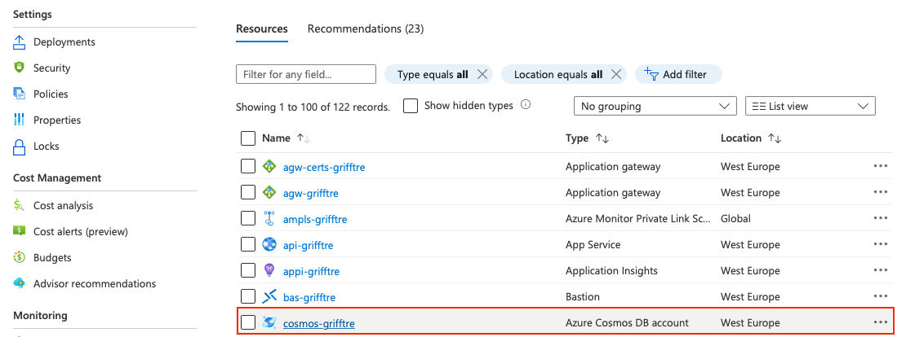
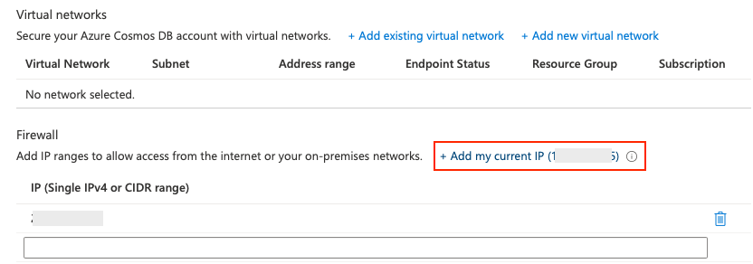
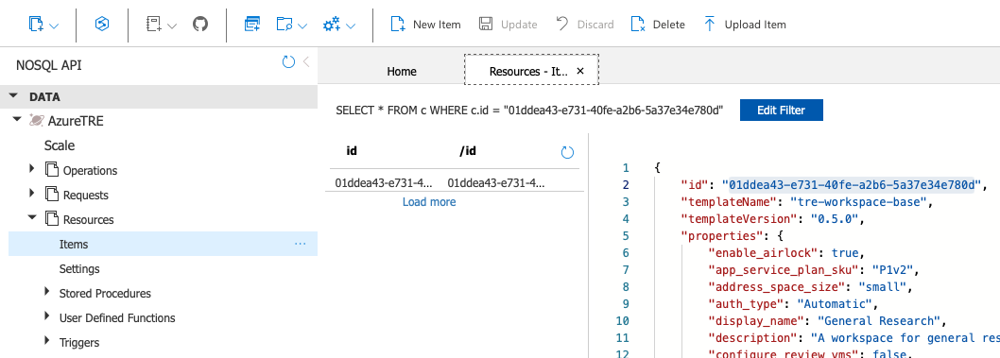

# Manually editing resources in Cosmos DB

On occasion, resources in the TRE (i.e. a user resource, workspace service or workspace) can get into a corrupted state, usually when an operation performed by the API and Resource Processor has failed and has not been gracefully handled. This can leave the resource state stored in Cosmos out of sync with the state of the resource in Azure.

For scenarios where you need to manually modify the state of the TRE resource, you can use the following guide.

!!! caution
      This should only be performed when absolutely necessary. Modifying properties in a resource to unexpected/inaccurate values can cause various failures when the API/RP performs a subsequent operation on it.

## Find the Resource Id

We want to make sure we find the correct resource record in Cosmos before modifying it; we can do this by locating the Resource Id of the resource we wish to modify so we can correlate it later on. If you don't already know the Resource Id, follow one of the sub-sections below; otherwise, skip to [Access Cosmos DB](#access-cosmos-db).

### Using the TRE UI

1. Navigate to the UI in your browser (typically `{YOUR_TRE_ID}.{REGION}.cloudapp.azure.com`)

1. Find the resource card of the resourrce you wish to modify, then click the `i` button and copy the Resource Id

### Using the TRE API

1. Head to the Swagger UI (typically `{YOUR_TRE_ID}.{REGION}.cloudapp.azure.com/api/docs`)
    - If looking for a resource within a workspace (i.e. a workspace service or user resource), you will instead need to open `/api/workspaces/{WORKSPACE_ID}/docs`

1. Click *Authorize* and authenticate

1. Find the GET method for the resource type you're looking for, hit *Try it out*, fill in any required parameters, then click *Execute*.

1. Locate the item you're interested in within the response array and copy the value from the `id` field

  

## Access Cosmos DB

1. Find your Azure TRE main resource group (typically `rg-{YOUR_TRE_ID}`) in the Azure Portal and select the Cosmos DB instance (`cosmos-{YOUR_TRE_ID}`)

  

1. In the side-menu, select the *Networking* tab and click *Add my current IP* then *Save* to whitelist your IP in the Cosmos DB firewall.

  

1. This will start an operation that will take a few minutes to complete. You can check the status of this in the Notifications panel of the portal.

## Edit resource

1. Once the operation to whitelist your IP has completed, navigate to the *Data Explorer* pane, and you should see a list of collections. Select the appropriate one that you intend to modify (most likely *Resources*, which contains all of the deployed resources within your TRE), then select *Items*.

1. Click *Edit Filter* and enter `WHERE c.id = "{YOUR_RESOURCE_ID}"`, then press *Apply Filter*.

1. Select the only document in the list. You can now edit the JSON object within the Data Explorer editor, then hit *Update* when you're done. This will immediately update the resource in Cosmos DB.

  

!!! caution
    Don't forget to remove your IP from the Cosmos firewall whitelist when you're done!
